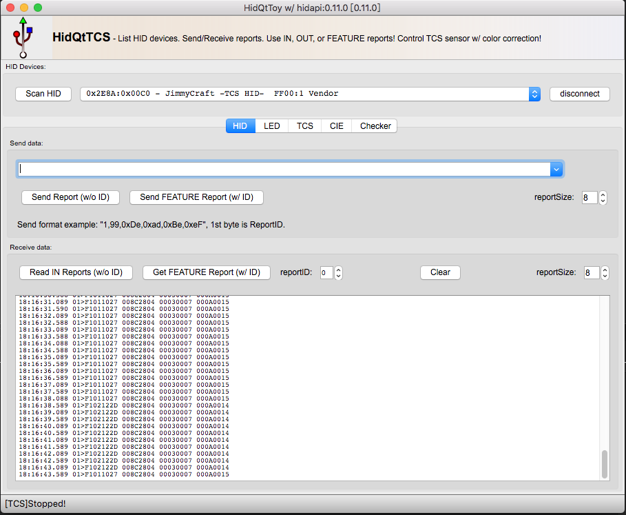
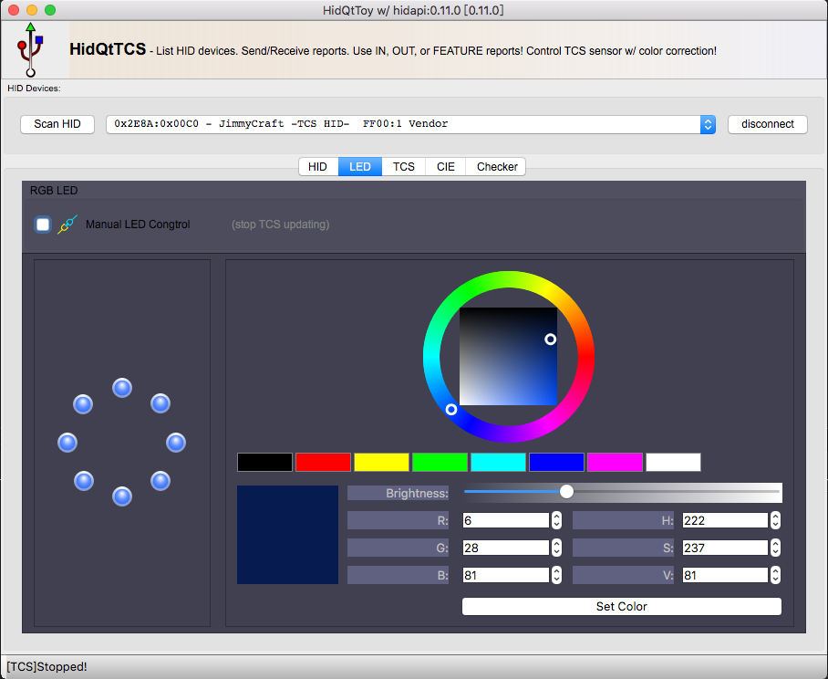
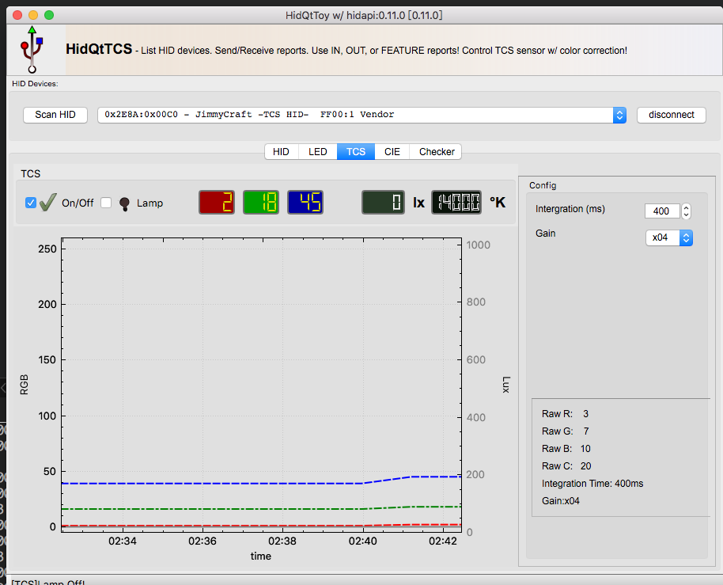
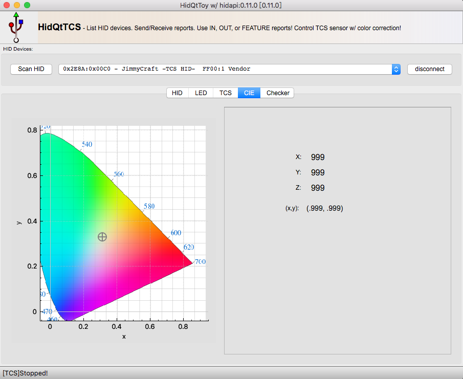

### Software projects

- hidQtCmd   
  A Qt framework command line tool for hidTCS color sensor project  
    
   
- hidQtTcs  
  A Qt GUI for hidTCS color sensor  
     
     
   
  
  
  
     
Reference:
- [HIDAPI](https://github.com/libusb/hidapi) HIDAPI library
- [CXXOptions](https://github.com/jarro2783/cxxopts) C++ command line options parser
- [HidApiTester](github.com/todbot) Tod's HIDAPI commandline tool
